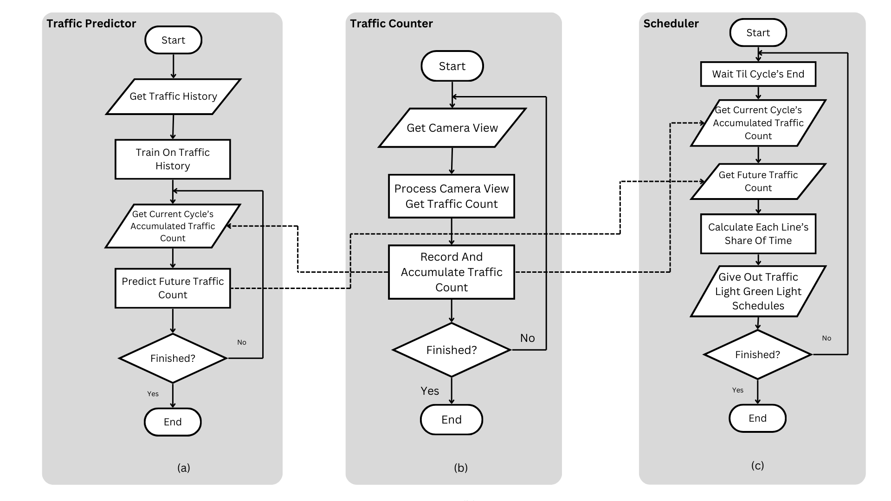
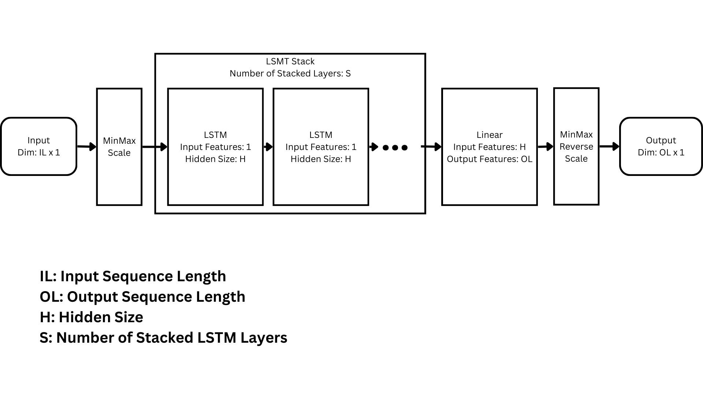
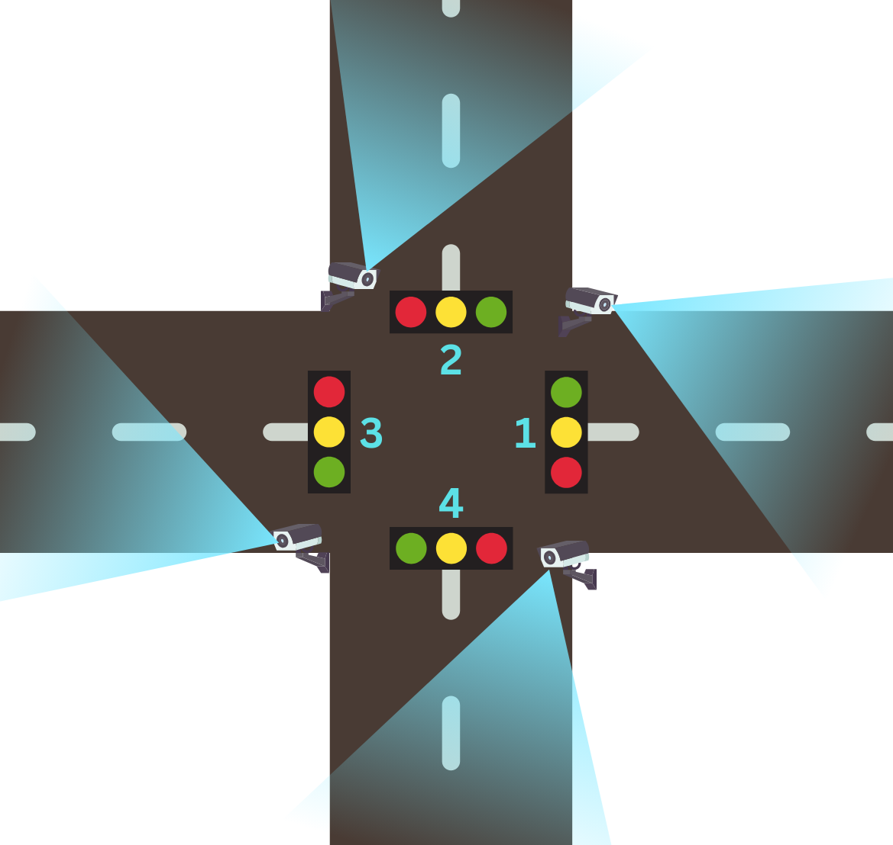
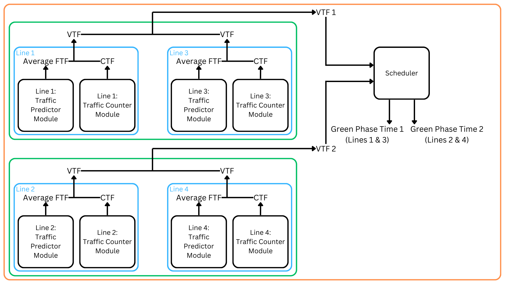

# Traffix

Traffix focuses on developing smart traffic lights. Smart traffic lights are ones that adapt their timings and schedules based on the incoming traffic flow from the different lines of an intersection.

## Introduction

There are various methodologies going around developing effective smart traffic lights. Such as using the genetic algorithm or VANETs. But in this project we've decided to take into account the current and future traffic flows of the lines to schedule the green signal phases of the traffic light. Thus, the software consists of three modules:
- Traffic predictor
- Traffic counter
- Scheduler

Here is the bigger picture flowchart of the three modules and their relations.

## Components

### Traffic Predictor

The traffic predictor makes use of the traffic flow history of an incoming line to predict its future flow for multiple steps. We've developed an LSTM model for this purpose.

Using the above model architecture, considering IL=168, OL=24, H=4 and S=1, and using the <a href="https://data.ny.gov/Transportation/Thruway-E-ZPass-Cash-Hourly-Usage-by-Plaza-Beginni/2hz2-2s5g/about_data">Thruway</a> dataset, we achieved an average MSE of 1.72%.

### Traffic Counter

The traffic counter modules takes in the intersection camera output to monitor the traffic condition of an incoming line and count the number of target vehicles in the incoming traffic. This data is directly used in scheduling the lights and also is accumulated till the end of the lights' cycle to get fed into the predictor for later predictions of future counts. For this system, we've developed an algorithm that employs YOLOv8 models via the Ultralytics package and have taken advantage of Ultralytics' powerful tracking task. We are using the <a href="https://docs.ultralytics.com/tasks/detect/#models">YOLOv8m</a> pre-trained model that achieved recall and precision values of respectively 93% and 98% with average prediction time of 63ms based on the <a href="http://www.uni-ulm.de/in/mrm/forschung/datensaetze.html">KoPER</a> dataset.

### Scheduler

The scheduler uses relatively simple mathematical equations to consider current and future traffic counts and schedule all the lights for the lines.

## Architecture

Considering the following structure of an intersection, where the opposite lines are synced in terms of traffic light signal phases:

The software' architecture will be as follows:

Note that the architecture's scheme is the same in all cases but the number of incoming lines and their sync relations are completely flexible and configurable via the `config.yaml` file.

## Demonstration

Here is a simple demonstration of the application's performance on the mentioned datasets. Note that since the Thruway and KoPER datasets were different essetially and their traffic numbers didn't match, we have scaled the live traffic monitoring count up by a factor of 10 to make the simulation more realistic.

https://drive.google.com/file/d/1NCsx6SupszUPYqaHINdGzUmfeda_aQn0/view?usp=sharing
